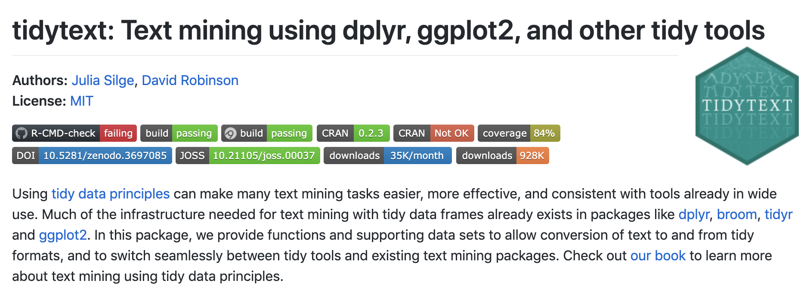
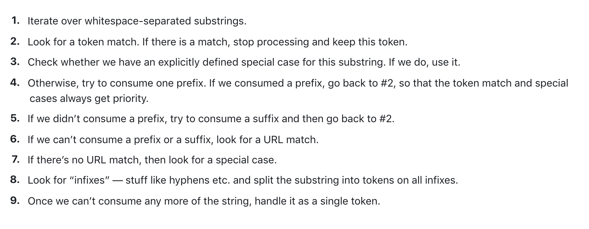

```{r include=FALSE}
library(knitr)
hook_output <- knit_hooks$get("output")
knit_hooks$set(output = function(x, options) {
  lines <- options$output.lines
  if (is.null(lines)) {
    return(hook_output(x, options))  # pass to default hook
  }
  x <- unlist(strsplit(x, "\n"))
  more <- "..."
  if (length(lines) == 1) {        # first n lines
    if (length(x) > lines) {
      # truncate the output, but add ....
      x <- c(head(x, lines), more)
    }
  } else {
    x <- c(more, x[lines], more)
  }
  # paste these lines together
  x <- paste(c(x, ""), collapse = "\n")
  hook_output(x, options)
})
knit_hooks$set(output = function(x, options) {
  # this hook is used only when the linewidth option is not NULL
  if (!is.null(n <- options$linewidth)) {
    x = knitr:::split_lines(x)
    # any lines wider than n should be wrapped
    if (any(nchar(x) > n)) x = strwrap(x, width = n)
    x = paste(x, collapse = '\n')
  }
  hook_output(x, options)
})

opts_chunk$set(
  echo = TRUE,
  fig.width = 7, 
  fig.align = 'center',
  fig.asp = 0.618, # 1 / phi
  out.width = "700px")
```

```{css, echo = FALSE}
.orange {color: #EF8633}
```

## Acknowledgment

These slides were originally developed by Emil Hvitfeldt and modified by Dylan Cable, George G. Vega Yon, and Kelly Street.

---

# Plan for the week

- We will try to turn text into numbers
- Then use tidy principals to explore those numbers

---



---

# Why tidytext?

Works seemlessly with ggplot2, dplyr and tidyr.

**Alternatives:**

**R**: quanteda, tm, koRpus

**Python**: nltk, Spacy, gensim

---

## Alice's Adventures in Wonderland

Download the `alice` dataset from [https://github.com/dmcable/BIOSTAT620/blob/main/data/text/alice.rds](https://github.com/dmcable/BIOSTAT620/blob/main/data/text/alice.rds))

```{r message=FALSE, warning=FALSE}
library(tidyverse)
alice <- readRDS("../data/text/alice.rds") # "~/Downloads/alice.rds"
alice
```

---

# Tokenizing

Turning text into smaller units


In English:

- split by spaces
- more advanced algorithms

---

# Spacy tokenizer



---

## Turning the data into a tidy format

```{r}
library(tidytext)
alice |>
  unnest_tokens(token, text)
```

---

# Words as a unit

Now that we have words as the observation unit we can use the **dplyr** toolbox.

---

## Using `dplyr` verbs

```{r dplyr1}
library(dplyr)
alice |>
  unnest_tokens(token, text)
```

---

## Using `dplyr` verbs

```{r dplyr2}
library(dplyr)
alice |>
  unnest_tokens(token, text) |>
  count(token)
```

---

## Using `dplyr` verbs

```{r dplyr3}
library(dplyr)
alice |>
  unnest_tokens(token, text) |>
  count(token, sort = TRUE)
```

---

## Using `dplyr` verbs

```{r dplyr4}
library(dplyr)
alice |>
  unnest_tokens(token, text) |>
  count(chapter, token)
```

---

## Using `dplyr` verbs

```{r dplyr5}
library(dplyr)
alice |>
  unnest_tokens(token, text) |>
  group_by(chapter) |>
  count(token) |>
  top_n(10, n)
```

---

## `dplyr` verbs and `ggplot2`{.smaller}

```{r dplyr6}
library(dplyr)
library(ggplot2)
alice |>
  unnest_tokens(token, text) |>
  count(token) |>
  top_n(10, n) |>
  ggplot(aes(n, token)) +
  geom_col()
```

---

## `dplyr` verbs and `ggplot2`{.smaller}

```{r dplyr7}
library(dplyr)
library(ggplot2)
library(forcats)
alice |>
  unnest_tokens(token, text) |>
  count(token) |>
  top_n(10, n) |>
  ggplot(aes(n, fct_reorder(token, n))) +
  geom_col()
```

---

# Stop words

A lot of the words don't tell us very much. Words such as "the", "and", "at" and "for" appear a lot in English text but doesn't add much to the context.

Words such as these are called **stop words**

For more information about differences in stop words and when to remove them read this chapter: [https://smltar.com/stopwords](https://smltar.com/stopwords)

---

## Stop words in tidytext

`tidytext` comes with a built-in `data.frame` of stop words

```{r}
stop_words
```

---

## Stop word lexicons

```{r}
table(stop_words$lexicon)
```

---

## `snowball` stopwords

```{r stopwordsSnowball}
stop_words |>
  filter(lexicon == "snowball") |>
  pull(word)
```

---

## Duplicated stopwords

```{r duplicatedStopwords}
sort(table(stop_words$word), decreasing = TRUE)
```

---

## Removing stopwords

We can use an `anti_join()` to remove the tokens that also appear in the `stop_words` `data.frame`

```{r stopwords2}
alice |>
  unnest_tokens(token, text) |>
  anti_join(stop_words, by = c("token" = "word")) |>
  count(token, sort = TRUE)
```

---

## Anti-join with same variable name

```{r stopwords3}
alice |>
  unnest_tokens(word, text) |>
  anti_join(stop_words, by = c("word")) |>
  count(word, sort = TRUE)
```

---

## Stop words removed

```{r stopwords4}
alice |>
  unnest_tokens(word, text) |>
  anti_join(stop_words, by = c("word")) |>
  count(word, sort = TRUE) |>
  top_n(10, n) |>
  ggplot(aes(n, fct_reorder(word, n))) +
  geom_col()
```

---

## Which words appear together?

**ngrams** are sets of `n` consecutive words and we can count these to see which words appear together most frequently.


- ngrams with n = 1 are called "unigrams": "which", "words", "appear", "together"
- ngrams with n = 2 are called "bigrams": "which words", "words appear", "appear together"
- ngrams with n = 3 are called "trigrams": "which words appear", "words appear together"

---

## Which words appear together?

We can extract bigrams using `unnest_ngrams()` with `n = 2`

```{r}
alice |>
  unnest_ngrams(ngram, text, n = 2)
```

---

## Which words appear together?

Tallying up the bigrams still shows a lot of stop words, but it is able to pick up some common phrases:

```{r}
alice |>
  unnest_ngrams(ngram, text, n = 2) |>
  count(ngram, sort = TRUE)
```

---

## Which words appear together?

```{r}
alice |>
  unnest_ngrams(ngram, text, n = 2) |>
  separate(ngram, into = c("word1", "word2"), sep = " ") |>
  select(word1, word2)
```

---

```{r}
alice |>
  unnest_ngrams(ngram, text, n = 2) |>
  separate(ngram, into = c("word1", "word2"), sep = " ") |>
  select(word1, word2) |>
  filter(word1 == "alice")
```

---

What about when the first word is "alice"?

```{r}
alice |>
  unnest_ngrams(ngram, text, n = 2) |>
  separate(ngram, into = c("word1", "word2"), sep = " ") |>
  select(word1, word2) |>
  filter(word1 == "alice") |>
  count(word2, sort = TRUE)
```

---

What about when the second word is "alice"?

```{r}
alice |>
  unnest_ngrams(ngram, text, n = 2) |>
  separate(ngram, into = c("word1", "word2"), sep = " ") |>
  select(word1, word2) |>
  filter(word2 == "alice") |>
  count(word1, sort = TRUE)
```

---

# TF-IDF

**TF**: Term frequency  
**IDF**: Inverse document frequency


**TF-IDF**: product of TF and IDF

TF gives weight to terms that appear a lot, IDF gives weight to terms that appears in a few documents

---

# TF-IDF with `tidytext`

```{r tfidf1}
alice |>
  unnest_tokens(text, text)
```

---

# TF-IDF with `tidytext`

```{r tfidf2}
alice |>
  unnest_tokens(text, text) |>
  count(text, chapter)
```

---

# TF-IDF with `tidytext`

```{r tfidf3}
alice |>
  unnest_tokens(text, text) |>
  count(text, chapter) |>
  bind_tf_idf(text, chapter, n)
```

---

# TF-IDF with `tidytext`

```{r tfidf4}
alice |>
  unnest_tokens(text, text) |>
  count(text, chapter) |>
  bind_tf_idf(text, chapter, n) |>
  arrange(desc(tf_idf))
```

---

# Sentiment Analysis

Also known as "opinion mining," sentiment analysis is a way in which we can use computers to attempt to understand the feelings conveyed by a piece of text. This generally relies on a large, human-compiled database of words with known associations such as "positive" and "negative" or specific feelings like "joy", "surprise", "disgust", etc.

---

# Sentiment Analysis


---

## Sentiment Lexicons

The `tidytext` and `textdata` packages provide access to three different databases of words and their associated sentiments (known as "sentiment lexicons"). Obviously, none of these can be perfect, as there is no "correct" way to quantify feelings, but they all attempt to capture different elements of how a text makes you feel.

The readily available lexicons are:

 - `afinn` from [Finn Årup Nielsen](http://www2.imm.dtu.dk/pubdb/views/publication_details.php?id=6010)
 - `bing` from [Bing Liu and collaborators](https://www.cs.uic.edu/~liub/FBS/sentiment-analysis.html)
 - `nrc` from [Saif Mohammad and Peter Turney](https://saifmohammad.com/WebPages/NRC-Emotion-Lexicon.htm)

---

## Sentiment Lexicons - `bing`

The `bing` lexicon contains a large list of words and a binary association, either "positive" or "negative":

```{r}
library(textdata)
get_sentiments('bing')
```

---

## Sentiment Lexicons - `afinn`

The `afinn` lexicon goes slightly further, assigning words a value between -5 and 5 that represents their positivity or negativity.

```{r}
get_sentiments('afinn')
```

---

## Sentiment Lexicons - `nrc`

The `nrc` lexicon takes a different approach and assigns each word an associated sentiment. Some words appear more than once because they have multiple associations:

```{r}
get_sentiments('nrc')
```

---

## Sentiment Analysis{.smaller}

We can use one of these databases to analyze _Alice's Adventures in Wonderland_ by breaking the text down into words and combining the result with a lexicon. Let's use `bing` to assign "positive" and "negative" labels to as many words as possible in the book. (Note that this time the variable created by `unnest_tokens` is called `word`, to match the column name in `bing`).

```{r}
alice |>
  unnest_tokens(word, text) |>
  inner_join(get_sentiments("bing"))
```

---

## Sentiment Analysis

We can now group and summarize this new dataset the same as any other. For example, let's look at the sentiment by chapter. We'll do this by counting the number of "positive" words and subtracting the number of "negative" words:

```{r}
diff_by_chap <- alice |>
  unnest_tokens(word, text) |>
  inner_join(get_sentiments("bing")) |> 
  group_by(chapter) |> 
  summarise(sentiment = sum(sentiment == "positive") - sum(sentiment == "negative"))
```

---

## Sentiment Analysis

```{r}
diff_by_chap
```

---

## Sentiment Analysis

```{r}
barplot(diff_by_chap$sentiment, names.arg = diff_by_chap$chapter)
```

---

## Sentiment Analysis

Alternatively, we could use the `afinn` lexicon and quantify the "sentiment" of each chapter by the average of all words with numeric associations:

```{r}
avg_by_chap <- alice |>
  unnest_tokens(word, text) |>
  inner_join(get_sentiments("afinn")) |> 
  group_by(chapter) |> 
  summarise(sentiment = mean(value))
```

---

## Sentiment Analysis

```{r}
barplot(avg_by_chap$sentiment, names.arg = avg_by_chap$chapter)
```

---

## Sentiment Analysis{.smaller}

Similarly, we can find the most frequent sentiment association in the `nrc` lexicon for each chapter. Unfortunately, for all chapters, the most frequent sentiment association ends up being the rather bland "positive" or "negative":

```{r, warning=FALSE}
alice |>
  unnest_tokens(word, text) |>
  inner_join(get_sentiments("nrc")) |> 
  group_by(chapter) |> 
  summarise(sentiment = names(which.max(table(sentiment))))
```

---

## Sentiment Analysis

We'll try to spice things up by removing "positive" and "negative" from the `nrc` lexicon:

```{r, warning=FALSE}
nrc_fun <- get_sentiments("nrc")
nrc_fun <- nrc_fun[!nrc_fun$sentiment %in% c("positive","negative"), ]
```

---

## Sentiment Analysis

Now we see a lot of "anticipation":

```{r, warning=FALSE}
alice |>
  unnest_tokens(word, text) |>
  inner_join(nrc_fun) |> 
  group_by(chapter) |> 
  summarise(sentiment = names(which.max(table(sentiment))))
```

---

## Importing data


- One of the most common ways of storing and sharing data is through electronic **spreadsheets**.

- A spreadsheet is a file version of a data frame.

- But there are many ways to store spreadsheets in files.

## Importing data

To import data we need to:

- Identify the file's location.

- Know what function or _parsers_ to use.

For the second step it helps to know the file type and _encoding_.


## File types

- Files can generally be classified into two categories: **text** and **binary**.

- We describe the most widely used format for storing data for both these types and learn how to identify them.


## Text files

- You have already worked with text files: R scripts and Quarto files, for example.

- **dslabs** offers examples:

```{r}
#| echo: false
. <- file.remove("murders.csv")
```

```{r}
dir <- system.file(package = "dslabs") 
file_path <- file.path(dir, "extdata/murders.csv") 
file.copy(file_path, "murders.csv") 
```

## Text files

* An advantage of text files is that we can easily "look" at them without having to purchase any kind of special software or follow complicated instructions.

* Exercise: 
    - copy `murders.csv` into your working directory and examine it with `less`.
    - Then try the _Open file_ RStudio tool.

## Text files


- Line breaks are used to separate rows and a _delimiter_ to separate columns within a row.

- The most common delimiters are comma (`,`), semicolon (`;`), space (` `), and tab (`\t`).

- Different parsers are used to read these files, so we need to know what delimiter was used.

- In some cases, the delimiter can be inferred from file suffix: `csv`, `tsv`, for example.

- But we recommend looking at the file rather than inferring from the suffix.


## Text files

- In R, you can look at any number of lines from within R using the `readLines` function:

```{r} 
readLines("murders.csv", n = 3) 
``` 


## Binary files

- Opening image files such as jpg or png in a text editor or using `readLines` in R will not show comprehensible content: these are _binary_ files.

- Unlike text files, which are designed for human readability and have standardized conventions, binary files have many formats specific to their data type.

- While R's `readBin` function can process any binary file, interpreting the output necessitates a thorough understanding of the file's structure.

- We focus on the the most prevalent binary formats for spreadsheets: Microsoft Excel xls and xlsx.

## R Base Parsers

Here example of useful R base parsers:

```{r}
#| message: false
#| warning: false
x <- read.table("murders.csv", sep = "\t")
x <- read.csv("murders.csv")
```


## readr Parsers

**readr**  provides alternatives that produce tibbles:

```{r}
#| message: false
#| warning: false
library(readr)
x <- read_csv("murders.csv")
x <- read_delim("murders.csv", delim = "\t")
```

Notice the messages produced.

## readr Parsers

| Function  | Format                                           | Suffix |
|-----------|--------------------------------------------------|----------------| 
| read_table| white space separated values | txt | 
| read_csv | comma separated values |  csv | 
| read_csv2 | semicolon separated values | csv | 
| read_tsv | tab separated values | tsv | 
| read_delim | must define delimiter | txt | 
| read_lines | similar to `readLines` | any file |


## readxl Parsers

For Excel files you can use the **readxl** package.

```{r}
library(readxl)
fn <- file.path(dir, "extdata/2010_bigfive_regents.xls") 
y <- read_xls(fn)
```

## readxl Parsers

You can read specific sheets and see them using

```{r}
excel_sheets(fn)
```

Note that `read_xls` has a sheet argument.


## readxl Parsers


| Function  | Format                                           | Suffix |
|-----------|--------------------------------------------------|----------------|  
| read_excel | auto detect the format | xls, xlsx| 
| read_xls | original format |  xls | 
| read_xlsx | new format | xlsx | 
| excel_sheets | detects sheets | xls, xlsx| 


## data.table Parsers

The **data.table** package provide a very fast parser:

```{r}
library(data.table)
x <- fread("murders.csv")
```

Note: It returns a file in `data.table` format which we have mentioned but not explained.

## scan

* The `scan` function is the most general parser. 

* It will read in any text file and return a vector so you are on your own coverting it to a data frame.

* Because it returns a vector, you need to tell it in advance what data type to expect:

```{r}
scan("murders.csv", what = "c", sep = ",", n = 10)
```

* It can also be used to read from the console. Try typing `scan()`. Hit return to stop.

## Encoding

- Computer translates everything into 0s and 1s.

- ASCII is an _encoding_ system that assigns specific numbers to characters.

- Using 7 bits, ASCII can represent $2^7 = 128$ unique symbols, sufficient for all English keyboard characters.

- However, many global languages contain characters outside ASCII's range.


## Encoding

- For instance, the é in "México" isn't in ASCII's catalog.

- To address this, broader encodings  emerged.

- Unicode offers variations using 8, 16, or 32 bits, known as UTF-8, UTF-16, and UTF-32.

- RStudio typically uses UTF-8 as its default.

- Notably, ASCII is a subset of UTF-8, meaning that if a file is ASCII-encoded, presuming it's UTF-8 encoded won't cause issues.


## Encoding

- However, there other encodings, such as ISO-8859-1 (also known as Latin-1) developed for the western European languages, Big5 for Traditional Chinese, and ISO-8859-6 for Arabic.

- Take a look at this file:

```{r} 
#| cache: false 
fn <- "calificaciones.csv" 
file.copy(file.path(system.file("extdata", package = "dslabs"), fn), fn) 
readLines(fn, n = 1) 
``` 


## Encoding

- The __readr__ parsers permit us to specify an encoding.

- It also includes a function that tries to guess the encoding:

```{r} 
guess_encoding("murders.csv") 
guess_encoding("calificaciones.csv") 
``` 

## Encoding

- Once we know the encoding we can specify it through the `locale` argument:

```{r} 
dat <- read_csv("calificaciones.csv", show_col_types = FALSE, 
                locale = locale(encoding = "ISO-8859-1")) 
``` 

- We'll learn more about locales later.

## Encoding

- We can now see that the characters in the header were read in correctly:

```{r} 
dat
``` 


## Downloading files

- A common place for data to reside is on the internet.

- We can download these files and then import them.

- We can also read them directly from the web.


```{r} 
url <- paste0("https://raw.githubusercontent.com/", 
              "rafalab/dslabs/master/inst/extdata/murders.csv") 
x <- read.csv(url) 
``` 

## Downloading files

- If you want a local copy, you can use `download.file`:

```{r} 
download.file(url, "murders.csv") 
``` 

- This will download the file and save it on your system with the name `murders.csv`.

- Note You can use any name here, not necessarily `murders.csv`.

## Downloading files

:::{.callout-warning}
The function `download.file` overwrites existing files without warning.
:::

- Two functions that are sometimes useful when downloading data from the internet are `tempdir` and `tempfile`.

```{r} 
#| eval: false

tmp_filename <- tempfile() 
download.file(url, tmp_filename) 
dat <- read_csv(tmp_filename) 
file.remove(tmp_filename) 
``` 

```{r}
#| echo: false
if (file.exists("murders.csv")) { . <- file.remove("murders.csv")}
if (file.exists("calificaciones.csv" )) { . <- file.remove("calificaciones.csv") }
```

